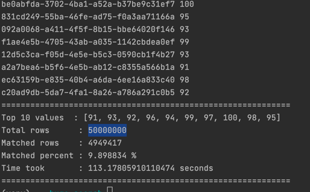

## Top N search from huge list

> Given a file with two columns, uuid and a value (assuming value is an integer.
> 
> Print uuid with top N values to stoud

#### Data Generator
To generate the file to play with, use

`python data_generator.py --file_path <OUTPUT_FILE_PATH>`

#### Get Top N 
To get the uuids with top N values, use

`python main.py --file_path <INPUT_FILE_PATH> --n <N int>`

---

#### Sample

