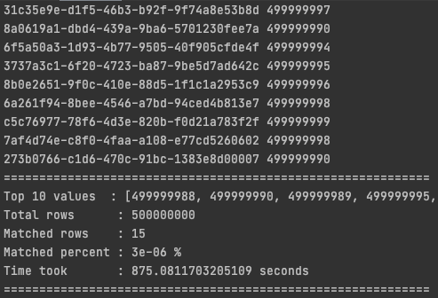

## Top N search from a huge list


> Given a file with two columns, uuid and a number (assuming values to be integers).
> 
> Print uuid with top N values to stdout


### Approach

Scan through the file and add all the elements to a min-heap with size N.
Meanwhile, add the value and uuid to a dictionary to do a one scan through.

```
Big-O

Time   : O(Klog(N))
Memory : O(N)

N: Top N values to get. 
K: Number of rows in data.
```

---

### Data Generator
To generate the file to play with, use

`python data_generator.py --file_path <OUTPUT_FILE_PATH> --count <#ROWS>`

(50000000 rows => 2 GB)


### Get Top N 
To get the uuids with top N values, use

`python main.py --file_path <INPUT_FILE_PATH> --n <N int>`

---

#### Sample

##### Rows = 50M (2GB)


##### Rows = 500M (20GB)


a

---

#### One scan

```
Time took       : 76.49568700790405 seconds
```

#### Two Scan

```
Time took       : 131.64584374427795 seconds

```